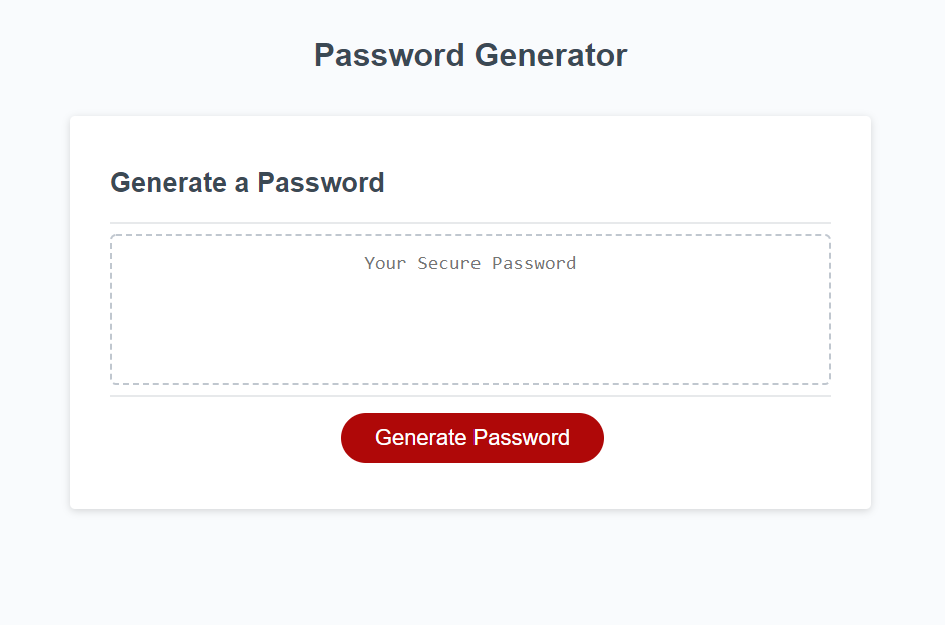

# 03 JavaScript: Password Generator

## Project Description

<pre>
  For this homework we were provided with the CSS and HTML code for the website and asked to create the Javascript
Code which would create a random password inside the browser. My appproach to this project was to initially create
a set of arrays for the different series of characters that may be used within the password (upperCase, lowerCase,
special and numbers). I then created two empty arrays (options and passwordArray) which would be the staging ground for my functions and where I would push values into it.
  
  The first thing to be done is to have the user choose the length of the password between 8 characters and 128.
Within the function I used a do..while loop in order to make sure the input was a number and between the range of
allowed characters. If anyone was to put a number outside the range or a word the question would prompt again.

  Once a length is chosen then a series of confirms are presented to the screen asking for what kind of characters
should be in the password. These are set to a truthy or falsy value which will be used to determine how the next
functions behave.

  My generateOptions() function checks each of the prior character type prompts and for each truthy value it pushes
the corresponding array to the options array. The next function called getOptions takes the options array that was
just determined and finds a single random element. This is later used in the generatePassword function where the
random element will be pushed to the passwordArray array for the user determined length of the password.

  The next two functions were created with the intent of making sure a produced password will have at least one
element from each style that was selected by the user. For example, if a password is supposed to have a lower case
character but ends up not having one this will trigger the password to be generated again. I completed this task
first by creating a function called findCommonElement. I utilized a nested function in order to compare the
passwordArray with the character arrays I defined at the top of the code. With this function if there is even one
common element the function will return true, otherwise it will be false.

  Next, the findCommonElement function is used within the checkPassword function. In this function we are again
checking for the user input of each type of character. I am specifically looking for a false value in this function
which would ultimately trigger the password to regenerate so I needed to make sure if upperCase was not checked by
the user it would return a truthy value. For this reason I created basic variables that would be defined with a
string ('N/A') if the checked value was falsy. In boolean terms a string is truthy so it works well in this scenario.

  Now, the only way for a falsy value to come from each if statement is if the passwordArray and the character 
array it is being checked against do not have a common element between eachother. If that happens the final if...
else statement at the bottom of the function will render the entire function false. Otherwise it will return true.

  Finally, we've come to the generatePassword function. At the very beginning of this function I make sure to set 
the passwordArray to a blank array that way the written password resets every time. Then a loop is used with the 
getOptions function to find random elements from the options array and push each to the passwordArray for a number
of times determined by the user input (passwordLength). 

  Once we have a passwordArray we check the array to make sure it has each of the necessary elements using the 
checkPassword function and if it does we turn the array into a string using .join(''). Otherwise we call
generatePassword from within the function to run again and generate a new password.

  Below the generatePassword function we have about 15 lines of code which connect all these functions and arrays
to the webpage. When the webpage is loaded I intend for the chooseLength, userInput and generateOptions function
to run immediately. Then, the password is revealed once the "Generate Password" button is clicked. The user can 
click the button again to regenerate a password with the same elements determined earlier. If the user wants to 
change the length of the password or what characters are included all they need to do is reload the webpage to make
their choices again. I did it this way because, in my perspective someone may want to look for a random password 
that they like and don't want to set the same options every time. 

  For future developments of the random password generator I would like to create another button which would reset
all the user parameters and reprompt. I would also like to adjust the presentation so that the questions are being
asked using checkboxes and slider bars rather than window pop ups. 
</pre>

## User Story

```
AS AN employee with access to sensitive data
I WANT to randomly generate a password that meets certain criteria
SO THAT I can create a strong password that provides greater security
```

## Acceptance Criteria

```
GIVEN I need a new, secure password
WHEN I click the button to generate a password
THEN I am presented with a series of prompts for password criteria
WHEN prompted for password criteria
THEN I select which criteria to include in the password
WHEN prompted for the length of the password
THEN I choose a length of at least 8 characters and no more than 128 characters
WHEN asked for character types to include in the password
THEN I confirm whether or not to include lowercase, uppercase, numeric, and/or special characters
WHEN I answer each prompt
THEN my input should be validated and at least one character type should be selected
WHEN all prompts are answered
THEN a password is generated that matches the selected criteria
WHEN the password is generated
THEN the password is either displayed in an alert or written to the page
```

## My Project



- Website: https://polsen-92.github.io/password_generator/

## Future Developments

- Adding a reset button so that the user choices can be chosen again without having to reload the page
- Having the prompts for the type and length of password be present on the screen above the "Generate Password" button so that they can be changed easily